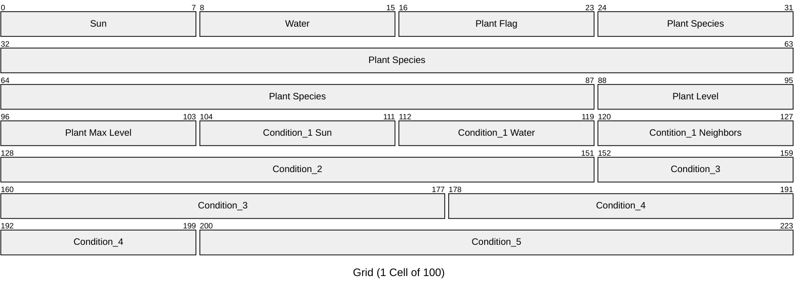

# Devlog Entry: Formation - 11/15/2024

F Team Formation

### **Github**

Link: [https://github.com/cohamil/Orechard-Outlet](https://github.com/cohamil/Orechard-Outlet)

### **Introducing the Team**

* Tools Lead: Connor Hamilton  
* Engine Lead: Ani Sindhu  
* Design Lead:Yahli Kijel

### **Tools and Materials**

**1**. Tell us about what engines, libraries, frameworks, and or platforms you intend to use, and give us a tiny bit of detail about why your team chose those.

* Phaser, we chose this framework because we all have prior experience with Phaser in CMPM 120\. We liked the tools that are available with Phaser and believe that it is suitable for this project. Additionally, because we’ve been using TypeScript for this class, we wanted to pick a framework that supported this language.  

**2**. Tell us programming languages (e.g. TypeScript) and data languages (e.g. JSON) you team expects to use and why you chose them. Presumably you’ll just be using the languages expected by your previously chosen engine/platform.

* Our team will be using TypeScript to code this game and use JSON to contain object data. Phaser 3 natively supports Javascript, but the developer created supporting build and definitions files which allow for coding in Typescript. Since Typescript is kind of like an extension of Javascript, JSON is completely compatible with the language. 

**3**. Tell us about which tools you expect to use in the process of authoring your project. You might name the IDE for writing code, the image editor for creating visual assets, or the 3D editor you will use for building your scene. Again, briefly tell us why you made these choices. Maybe one of your teammates feels especially skilled in that tool or it represents something you all want to learn about.

* We decided to use VS Code to write code for our project since it is the IDE that we are all most familiar and comfortable with. For our visual assets, we will be using a mix of GIMP and Aesprite because it is what our groupmates feel most confident in.

**4**. Tell us about your alternate platform choice. Remember, your alternate platform must differ from your primary platform by either changing the primary language used or the engine/library/framework used for building your user interface.

* For our alternate choice, we decided to switch our desired language from TypeScript to JavaScript. Our reasoning behind this choice has to do with our desire to continue to use Phaser throughout the development of our project. By switching to another language that is supported by Phaser and similar to our original language, we believe that this alternative will be a smooth transition.

### **Outlook**

* What is your team hoping to accomplish that other teams might not attempt?  
  * Use the things you grow to create specialized requests from NPCs  
  * Combine the things you are growing, mutations for plants  
  * Rather than growing foods, grow ores used for tool creation  
  * Growing consumables that can increase growth rates and provide buffs, etc.

* What do you anticipate being the hardest or riskiest part of the project?  
  * Overscoping/setting the bar too high for what we want to develop  
    * Not giving ourselves enough time to integrate every idea that we come up with

* What are you hoping to learn by approaching the project with the tools and materials you selected above?  
  * We hope to learn more practical ways to implement common game design patterns in real examples where we start off from scratch (as opposed to given templates in the Demo assignments). None of us have had the pleasure of creating a systemic game like this, so we are all reveling the the opportunity. We have all coded in Phaser in CMPM120, but not to create a game like this. In all, we all hope to learn more about game programming through this experience.

### Credits
https://github.com/phaserjs/template-esbuild-ts
* Template used for setting up Phaser3 project with Typescript.


# Devlog Entry: F0 - 11/22/2024
### How we satisfied the software requirements
**F0.a)** The game is displayed by a 2D grid. The player is able to navigate it with WASD to move from cell to cell. As of now, the grid is size 10x10 and the player moves 1 cell in the corresponding direction after each input.

**F0.b)** The player can manually move time ahead by pressing "T" on their keyboard after doing whatever actions they wanted on their turn. After advancing time, plants may or may not grow and cells containing sun/water may or may not change based on specific conditions pertaining to the state of that cell and its neighbors.

**F0.c)** The player can reap/sow plants in neighboring cells by using the Arrow Keys. For example, if the player uses the "UP" key, the cell above the player will either sow a plant if there is none or reap an existing one.

**F0.d)** Cells may or may not have a sun value and water levels. The precense of these resources in a cell is randomized and depicted with what colors are inside each cell. Yellow indicates that the cell contains sun while a shade of blue indicates that the cell contains water. A light shade of blue means that there is a little amount of water in that cell while a dark shade of blue means there is more water. Cells may accumulate water as turns pass. Sun and Water can exist in the same cell and this is indicated by the cell's background displayed as half yellow and half blue.

**F0.e)** Plants are currently depicted as small squares inside each cell. The color of each square represents the species of the plant and the size of the square represents its growth level. There are currently 3 different species of plants which can get upto a maximum growth level of 4.

**F0.f)** There are different rules for advancing a plant to its next growth level. Plants start at level 1 once they are planted. The conditions for advancing each level are as follows:
* For ALL Levels: The cell must have sun during that turn.
* Additional Level Specific Requirements:
    * To Level 2: The cell must have water during that turn.
    * To Level 3: The cell must have a lot of water during that turn.
    * To Level 4: The cell must have a lot of water and have no adjacent neighbors.
    
**F0.g)** The current win condition is for the player to start a turn with at least 3 plants at growth level 4.

### Reflection
Coming into this, our team had a very solid plan of using Phaser3 as a framework to base our game on and code it using typecript. We had seen that Phaser3 supports typecript and given our experience with the platform from previous classes, we felt confident in our ability to make a game from scratch using this framework in typescript. We all knew how to translate between typescript and javascript, so that was an added bonus considering any possible project requirements. Since Phaser3 is an HTML5 type of framework and is based on javascript, we knew it would support JSON for storing object data. All of us have experience using Visual Studio Code so that was the agreed upon code editor. While we did consider using a dedicated IDE, the familiarity of VS code's enviroment provided enough comfort to proceed with the project. Overall, we did not make any major design changes and our experience so far has not led us wanting to.

# Devlog Entry: F1 - 11/27/2024
### How we satisfied the software requirements
**F0.a)** Same as last week.
**F0.b)** Same as last week but a weather system has been implemented. The weather changes every new turn and the game displays a forecast indicating what the next turn's weather will be. Weather affects sun and water spawn rates per cell. Currently, there are 4 weather types:
"Sunny" weather increases the probability of sun.
"Cloudy" weather decreases the probability of sun.
"Rainy" weather increases the probability of water.
"Default" weather indicates that no special changes happen on the next turn.
**F0.c)** Same as last week.
**F0.d)** Same as last week.
**F0.e)** Same as last week.
**F0.f)** Same as last week. Each plant now contains a unique growth condition per level of advancement, making distinct plants unique and allowing for possible mutations in species.
**F0.g)** same as last week.
**F1.a)** The Grid is a 2D array of Cell objects which hold unique information pertaining to that Cell. Currently, the Grid is 10x10 Cells big, so there are 100 Cell objects. A Cell contains information regarding that Cell's sun and water levels as well as a potential Plant. Currently, a Plant is denoted by a species, current growth level, maximum growth level, and an array of growth conditions detailing specific requirements to advance the plant from one level to the next. In order to hold the conditions array into memory properly, we limited its size to 5. A condition is an object of 3 numbers specifying the sun level needed, water level needed, and the number of neighbors required for the Plant to level up. We store the contents of the Grid into a single contiguous byte array, so we must calculate the exact size of each Cell object.
Starting from the inside, a condition holds 3 numbers, so 3 bytes are needed for for each condition. There are a maximum of 5 conditions per plant, so the growth conditions array ends up at 15 bytes.
Regarding the Plant object, a species is an 8 character string, so we need 8 bytes to store it. The current growth level and maximum growth level are both numbers, so that is 2 more bytes. After adding the size of the conditions array, each Plant totals 25 bytes.
In a Cell, the sun and water levels are both numbers, adding 2 bytes per Cell. Since each Cell may or may not hold a Plant object, we use an additional byte to act as a flag which saves trouble for when we need to convert the byte array back into a 2D array of objects. Adding the Plant, each Cell has a maximum potential size of 28 bytes, or 224 bits.
To reduce visual clutter, 1 Cell of the Grid is shown and remaining Cells are stripped from the graph.

**F1.b)** Since our game is a web-based game, we were able to take advantage of a website's Local Storage. The player is able to save/load upto 5 games into memory by pressing the "L" key. Once the key is pressed, the player is presented with a prompt where they type in if they want to save to a slot or load from a slot. The program parses the input, ensuring the player wrote a valid statement, and then either loads or saves a game state. The essential game information (such as Grid state, player location, undo/redo operations) are stringified and saved into local storage with a set key for each save slot. Once the player requests a load, we load the game information from its Local Storage key and the game information is restored.
**F1.c)** The game autosaves every new turn. There is a designated save slot (Local Storage key identifaction) for auto saves and it does not count to the number of save slots a player has. When the game is reopened and an auto save exists, the game will ask the player if they want to load that game. If the player starts a new game, the next auto save will overrite the previous one. The auto save will load at the moment right before the player advanced to their next turn, with all actions made on their previous turn maintained.
**F1.d)** The player can undo all operations up until the start of the game using the "Z" key. Until a new action is performed, the player can redo all undo operations using the "X" key. The previous states of the grid and player are stored in an Array, allowing the player to undo all the way to before their first action (the start of the game). All undo actions are stored in a similar redo array, which is emptied once a new action is performed. The undo and redo arrays are also saved/loaded through game files.
### Reflection
Since our previous devlog, there have been no major design changes regarding our roles or choice of materials in the team. We are content with our choice of using Phaser and Visual Studio Code to create the game. The team's outlook on the project has definitely changed. We realized that we had slightly overscoped the game with the idea to sell growable items to complete specialized requests from non playable characters. We decided to first focus on the functionality of the farming system and project requirements. We will leave the idea of possible expansion for future devlogs. 
We decided to start finding ways to give the player feedback on their actions. Since only developers have been accessing the game, we started with absolutely nothing. The first step was to create a tutorial page that the player can use to learn how the game works and the available controls. In the tutorial panel, the player will find tabs regarding controls, an explanation of the core game loop and the win condition. Next, we decided to add some in game feedback for the player. Since remembering all species of plants and their unique growth conditions seems impractical, we added a plant information user interface which displays a plant's current condition, such as its name, current level, and the requirements to grow it to the next level.
# Devlog Entry: F2 - 12/02/2024
### How we satisfied the software requirements
#### F0+F1
**F0.a)** Same as last week.
**F0.b)** Same as last week.
**F0.c)** Same as last week.
**F0.d)** Same as last week.
**F0.e)** Same as last week.
**F0.f)** Same as last week.
**F0.g)** Same as last week.
**F1.a)** Same as last week.
**F1.b)** Same as last week.
**F1.c)** Same as last week.
**F1.d)** Same as last week.
#### External DSL for Scenario Design
We used an external DSL to allow game users to modify game settings for their next playthrough. So far, the user can decide the size of the playable grid, number of plants required at be max level to win the game, default spawn rates of sun and water per turn, and a weather forecast. The game will follow the forecast until enough turns have passed, meaning the the preset list has been iterated through, and then start behaving as normal.
The DSL is based on YAML. The program reads a config.yaml file which the user will write their settings to and parse it into a JSON object which is then used to decide game settings.
Here is what an example config.yaml file would look like. Lines prepended with a '#' character represent comments to give the user clarity regarding the changes they may make.
```
# Set dimensions (in number of cells) of the playable grid. The grid is always square. 
# Must be a whole number.
gridSize: 10

# Win Condition: Number of plants needed at max level at start of a new turn.
# Must be a whole number.
numPlantsToMax: 5

# Probability of resources in each cell for every new turn.
# Must be 0-1 inclusive.
defaultSunProbability: 0.4
defaultWaterProbability: 0.4

# Set order of weather for turns. Shorten/Extend as needed.
# Current options of weather:
# NORMAL
# SUNNY : double chances of sun
# RAINY : double chances of water
# CLOUDY : half chances of sun
weatherSchedule:
  - RAINY
  - NORMAL
  - SUNNY
  - NORMAL
```
There are currently 4 numeric settings and 1 list the user can set: 
Changing the "gridSize" value affects the size of the grid where plants can grow. The value represents the number of cells in each row and column of the grid.
Changing the "numPlantsToMax" value affects the number of plants the user must have at maximum level in order to win that game.
Changing the "default___Probability" values affects the default chances that a cell will gain the respective resource per turn change. A 0.4 means that on a normal turn, each cell has a 40% chance of gaining either sun or water.
Changing the contents of "weatherSchedule" allows the player to make a weather forecast that the game will follow until the preset list runs out. In this case, the first four days will have weather as described and then weather will operate as intended.
#### Internal DSL for Plants and Growth Conditions
The host language the internal DSL and project are based off is JavaScript. The design of the game requires for a variety of plants which all may behave differently. The purpose of the internal DSL is to allow the user to easily create a new species of plant without having to worry about the technical impact of the plant on the game. This also allows for rapid creation and destruction of plant species when the design of the game needs to be largely modified for balance purposes and such.
```javascript
const SpeciesName = {
    "lilac": "0xDA70D6",
    "daisy": "0x4CBB17",
    "tulip": "0xF28C28",
}
```
This is an object that contains all possible plant species and their colors. The user can add a new plant type by extending the object. The game is designed in a way such that each plant can have subspecies that may behave differently from the original. These differences are not to be visual, but in the plant's behavior, being their growth conditions. The user can create a mutated version of a plant type. Here is an example of creating a species of daisy.
```javascript
createSpecies("daisy" , 3 ,
[
{ requiredSun: 1, requiredWater: 1, requiredNeighbors: -1 },
{ requiredSun: 0, requiredWater: 2, requiredNeighbors: -1 },
{ requiredSun: 1, requiredWater: 2, requiredNeighbors: 0 }  
]
)
```
The ```3``` following ```"daisy"``` is the maximum possible level a plant of this species can get to. The following array is a list of growth conditions detailing specifications on how this version of a daisy can grow. Each growth condition object represents the requirements needed for a plant to grow to its next level, sorted by their order in the array. This means the first object in the array describes how the plant can grow from level 0 (a bud) to level 1 and so on. If the user only wants a specific level to be changed, they can only implement one condition and leave the rest of the array empty. The creation method will fill the rest of the array with default growing conditions. Using this DSL allows for the creation of a near infinite number of structurally unique plant species.

There is a reason this functionality would be difficult to offer in an external DSL. The object containing possible plant species will soon hold information regarding sprite sheets for a plant and functions unique to that type of plant describing its overall behavior. Subsequently, we want variations of a plant to be able to have unique functions as well. Creating new functions for unique interactions per type which is dependent on other parts of the file responsible for handling plants would be redundant to do with an external DSL. The external DSL would be severely coupled with the plant file and would have to be modified every time the structure of a plant needs to be changed. To practice good design, we want our code to be open for extensibility and closed for modification. Keeping the DSL internalized helps with this.

#### Switch to Alternate Platform
We decided to port our project from TypeScript to JavaScript. Due to the languages’ similarities, we believed that this translation would be mostly seamless. Before making this transition, we had to prepare our repository for the shift. We started by removing TypeScript type definitions from the dependencies in our package.json file. Additionally, we configured the building process to compile JavaScript files instead of TypeScript files by altering our build.prod.mjs and dev.server.mjs files to build from main.js instead of main.ts. 
After swapping our source code file extensions from TypeScript to JavaScript, we needed to update the code itself. Using Brace, we were able to provide our source code one module at a time and allow Brace to translate the provided TypeScript into JavaScript. Most of the changes involved removing type annotations, private class properties, and interfaces as they aren’t supported by JavaScript. We had anticipated making this change and designed our TypeScript files in a way that there would not be any major translation changes. An example of this was the intentional use of a frozen object literal to represent an enumerator instead of using TypeScript's built in "enum" keyword.  Because of this, the transition was mostly smooth and there wasn't any extensive restructuring required for the translation.
### Reflection
Since our previous devlog, we realized that our code looks visually disturbing to anyone who would review it. We decided to conduct a major refactoring session by modularizing the project. Previously, all source code for the game was being handeled in a massive 1000+ line game.js file. Our goal was to decouple aspects and systems of the game that have nothing to do with the game itself. We extracted code handling plant creation and all plant related interactions to its own file. We similarily extracted code pertaining to saving and loading a game to another file. Lastly, we extracted code pertaining to user interface elements to another file. Everything left in the main game file was code relating to the game itself. This refactoring significantly improved the source code's cohesion for any outside observers. It even helped the developers as well, reducing confusion when needing to find specific functions.
# Devlog Entry: F3 - 12/06/2024
### How we satisfied the software requirements
#### F0+F1+F2
**F0)** Mostly same as last week.
* **F0.a, b, c)** Player can use on screen UI to move, advance turns, and reap/sow plants in addition to keyboard.

**F1)** Mostly same as last week.
* **F1.b)** Player can use settings button and open a UI to choose from 3 save slots to use instead of manually typing in their save/load choice.
* **F1.d)** Player can use on screen UI to undo/redo actions in addition to keyboard.

**F2)** Same as last week.
#### Internationalization
To internationalize our game, we integrated the i18next library along with the i18next-browser-languagedetector plugin. This setup allows us to detect the user's language of choice and load the appropriate translations.
We initialized i18next with language detection and defined our translations in a structured format.
All player-facing text is stored in the resources object within the i18n initialization. This allows us to easily add or update translations without modifying the core game logic.
We used i18next's interpolation feature to handle dynamic content within strings, such as ```WinCondition``` and ```SlotNumber```.
#### Localization
The game currently supports 3 languages: English, Hebrew, and Chinese Mandarin. The entire development team speaks English while one member of the team speaks Hebrew and was able to translate it for us. We used Brace AI to translate from English to Mandarin since we had no native speakers available. Our prompt to the AI looked similar to this:
```
I need help translating the text in my game into Mandarin. Can you take the terms and sentences I provided below in English and convert them into Mandarin?

term 1
term 2
sentence 1
...
```
We did need to give the AI extra context for our project. We took the terms individually and stored them into an object in our system that i18n could use to differentiate bteween languages. The rest of the logic happens in code.
The user can select a chosen language from inside the game. The must open the Settings panel and select the "Change Language" button which opens a pop up list of languages the user can select. We understand that someone who does not speak the default language of this game (English) would have to comb through random UI buttons until something works. To address this issue, when the game is complete and launchable, there will be an extra pop up on the first game startup which asks the user what language they want to use. The functionality has not been added yet because we are currently focusing on more software requirements and code extensibility.
#### Mobile Installation
To make our game installable on a mobile device, we followed a guide on mobile deployment. The key video we used was: https://www.youtube.com/watch?v=E8BeSSdIUW4
We implemented a Progressive Web App (PWA) using a manifest file. This setup allows users to install the game on their devices. The manifest file provides metadata about the application, such as its name, description, start URL, display mode, and icons. This file is crucial for enabling the "Add to Home Screen" feature on mobile devices.
In our html file, we linked the manifest file and registered the service worker to ensure the PWA functionality is enabled.
#### Mobile Play
To make our game playable offline, we had to add a service worker to help the PWA. The service worker file is responsible for caching the necessary files to make the game available offline. It caches the HTML, CSS, JavaScript, and other assets during the installation phase and serves them from the cache when the user is offline.

We optimized the user interface for touch controls and smaller screens to ensure a smooth and enjoyable experience on mobile devices. Controls for mobile devices include arrow keys to move around, a button to swap between sowing/reaping and moving, a next turn button, and clickable undo/redo buttons.
### Reflection
Throughout this project, there have been no major design changes regarding our roles or choices of materials and tools. We have always been content with our choice of using Phaser and Visual Studio Code to create the game. Most of our design changes were regarding UI and sprite sheets. After making our game playable on mobile, we realized we needed to update the UI to give the player more visual feedback. We implemented touch screen controls that also work on a laptop with a mouse cursor for player movement, game interactions, and undo/redo actions. We began thinking about other ways we can make the game more visually expressive. Next, we changed the save and load system. Previously, the player had to type into a prompt window to save and load a game. Now we have a designate UI window for saving and loading files in the settings page. Finally, we added sprites to represent the plants which were previously only displayed as squares on screen. Once we added the sprites, we needed to figure out how to use them. We could not store them inside a plant object since plants are used for save files and saving entire sprite sheets could lead to disasters regarding memory managment. Instead, we used a second 2D array to represent to locations of all sprites which was intentionally coupled with the grid because the position of the sprite depends on the relative position of the cells inside the grid. Overall, our program design has definitely shifted towards being open for extensibility with the inclusion of the internal DSL for plants from F2 and internationalization of languages. We realize the usefulness of coding with future implementations as the patterns we implement early on will only carry over towards future development.